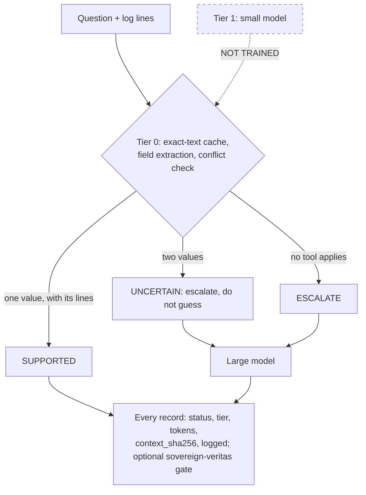
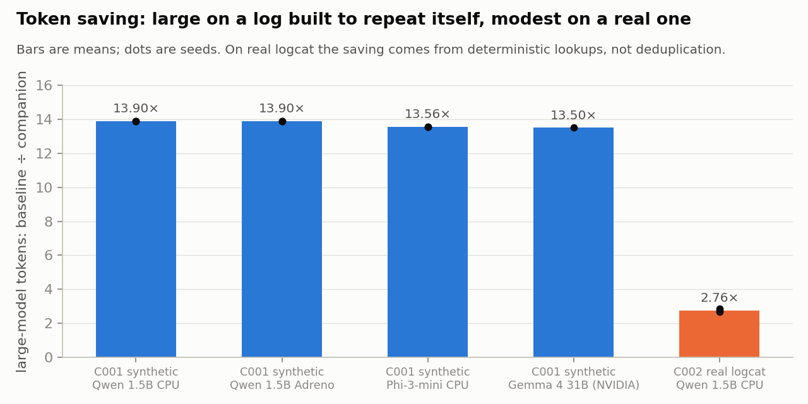
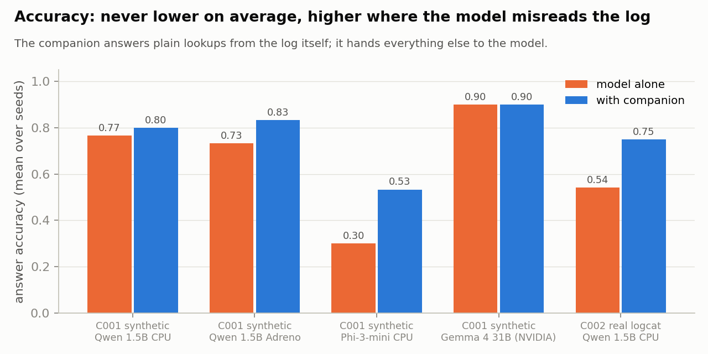

# veritas-companion

<!-- 30s-demo -->
> **Status labels.** **PROTOTYPE:** tier 0 (deterministic tools, cache, conflict flags) and the large-model
> bridge. **NOT TRAINED / DESIGN ONLY:** the small-model tier. **NOT PRODUCTION-READY:** all of it.

**Headline (measured on a Galaxy S25, [C002](experiments/C002_real_log/RESULTS.md)):** on a real Android
log, the companion answered 5 of 8 questions per window without the model and got every lookup right. It
used 2.67–2.86× fewer large-model tokens than the 1.5B model alone, and was more accurate on all 3 seeds.

### 30-second demo: PROTOTYPE (no model, no network)

```bash
git clone https://github.com/holland202/veritas-companion && cd veritas-companion
pip install numpy && python scripts/demo_30s.py
```

In this demo the "large model" is a rule-following test double. So the routing, statuses, cache and context
digests are real, and the model's answers are not. Output (x86_64, Python 3.11, 2026-09-30):

```
ok  What is the pressure of P01?               SUPPORTED -> '40'     via deterministic ctx d84439b4944a
ok  What is the pressure of P02?               UNCERTAIN -> '30'     via large_model   ctx d7df58914c05
ok  Which asset has the highest temperature?   ESCALATE  -> 'P03'    via large_model   ctx 9a2d0d4150f3
ok  What is the pressure of P01?               CACHED    -> '40'     via cache         ctx d84439b4944a
ok  same question, one changed line            UNCERTAIN -> '41'     (not served stale from the cache: C007)
    model calls 3 of 5 questions (a model-only setup makes 5)
DEMO PASS
```

### Negative results, up front

- **The 13.9× token saving from C001 does not transfer.** C001 used a log built to repeat itself. On real
  logs, exact deduplication removes at most 8% of lines (C002).
- **A simpler rival did as well on 2 of 3 seeds.** In C002 the control that answers with the tools and
  never escalates (N1) matched the companion's accuracy on seeds 2 and 3, using zero model tokens.
- **On logs nobody here designed, the tools answered nothing.** On Loghub HPC
  ([C006b](experiments/C006b_hpc/RESULTS.md)) they answered 0 of 60, so everything went to the model.
  The gate's safety prediction could not be tested (0 answers were ALLOWed). The first design (C006)
  could not run at all: [kept](experiments/C006_external_logs/RESULTS.md).
- **The cache used to let the gate ALLOW wrong answers.** Case-folded cache keys served `Ab12` for a log
  that said `aB12` ([C007](experiments/C007_cache_collision/RESULTS.md)). This was found by a red-team
  script on the phone and is fixed.



### Why this is not just a cache, RAG, or local inference

- **Not just a cache.** A cache returns the last answer. This returns a status: `UNCERTAIN` when the log
  holds two values, and a tool answer only when the log states it. The cache keys on exact text, because
  a looser key released wrong answers (C007).
- **Not just RAG.** Nothing is retrieved for the model to read. The cheap tier answers outright or steps
  aside, and every record says which tier answered.
- **Not local inference.** In C002 the saving came from answering lookups without any model, not from a
  smaller model.
- **Where it is no better:** questions outside the tools' patterns get no help at all (C006b).
<!-- /30s-demo -->


**A cheap efficiency layer beside a large model: deterministic tools first, a small model second,
the large model only when the cheaper tiers cannot answer with evidence.**

> The companion does not need to know everything the large model knows. It needs to know what the
> large model needs to know, and when to stay out of the way.

The large model still does the hard semantic work. The companion takes the high-volume, low-cost
friction around it: repeated context, repeated questions, simple lookups, conflicting values that
need a flag rather than a guess. The companion never becomes an authority. Each answer comes back
with a status and its evidence, and every delegation is logged, so any saving is measured.

## Status: what exists and what is only designed

| part | state |
|---|---|
| tier 0, deterministic: fingerprint dedup, answer cache, field extraction, conflict detection | **built, tested** (`companion/runtime.py`) |
| delegation log (task, tier, tokens, status, escalation, final answer) | **built** (JSONL) |
| tier 2, large model through a llama.cpp server | **built** (`companion/llm.py`) |
| [C002](experiments/C002_real_log/): the same companion on a real Android log | **4 of 4 held**: every lookup right; more accurate than the model alone on all 3 seeds; 2.67-2.86× fewer tokens. Exact dedup found almost nothing (≤ 8% of lines), so C001's 13.9× does not transfer |
| C001 on the Adreno GPU (R-ADRENO) | **6 of 6 held**; same tokens, some different model answers than on the CPU |
| [C005](experiments/C005_gate_bridge/): every delegation through the sovereign-veritas gate | **3 of 3 held**: 640 records → 640 packages, all CONSISTENT; 480 ALLOWed answers, 0 wrong; every conflict, escalation and cached model answer DEFERred |
| tier 1, small local model (about 135M) for fuzzy-but-small jobs | **designed only, NOT TRAINED, not wired** |
| [C001](experiments/C001_context_economy/): does tier 0 cut the large model's tokens without losing accuracy? | **6 of 6 held** on the S25: 13.9× fewer large-model tokens, 21× less wall time with overhead counted, accuracy within one question of the model alone (equal on seed 1, better on seed 2, one question worse on seed 3) |
| token-veritas context selection as a companion job | designed only |
| veritas-holo state fingerprints (E003) as a companion job | designed only |

<p>


</p>

Drawn by `scripts/make_figures.py` from the per-seed values in the results files named in the script.

## The measure

    efficiency gain = baseline large-model tokens / (companion cost + remaining large-model tokens)

The measure only counts when accuracy stays within a tolerance registered before the run. A
companion that costs 2,000 tokens to save 1,000 has failed, and so has one that saves tokens by
giving worse answers. In C001, tier 0 spends no model tokens; its time is logged as well.

## Rules

1. **Cheapest adequate tier first:** hash, parse, lookup, count, compare; then the small model;
   then the large model.
2. **The companion proposes; it never overrides.** Statuses: `SUPPORTED` (answered, with the
   lines that support it), `UNCERTAIN` (conflicting evidence: escalate, do not guess), `ESCALATE`
   (outside the cheap tiers), `CACHED`.
3. **Every delegation is logged.** The fields are task_id, task_type, delegated_to,
   companion_seconds, large_prompt_tokens, large_completion_tokens, companion_result, status,
   escalated, final_result, and cached_origin (for a CACHED answer, the tier that produced it).
4. **Controls that must fail:** C001 includes a companion that answers conflicts without escalating
   (N1) and one that prunes context at random instead of deduplicating (N2). If those did as well as
   the real companion, the experiment would be measuring nothing.
5. **Pilot before registration** on seeds the registered run never uses, then pre-register, then
   run fresh seeds. This is the method veritas-holo adopted after E004.

## Where it sits

    large model      semantic reasoning, planning, hard decisions
        ▲ │
        │ ▼
    companion        dedup · cache · extraction · conflict flags · (small model) · escalation
        │
    token-veritas    what deserves expensive tokens      (research repo)
    veritas-holo     structured state and history        (research repo)
    sovereign-veritas  gate and evidence packages        (governance repo)

## Run it

    python -m pytest -q
    python experiments/C001_context_economy/run.py --seed 101 --oracle     # plumbing check, NOT A RESULT
    python experiments/C001_context_economy/run.py --seed 101              # needs llama-server on :8080

Standard library plus NumPy; runs on a phone in Termux.

*Vincit Omnia Veritas.*
